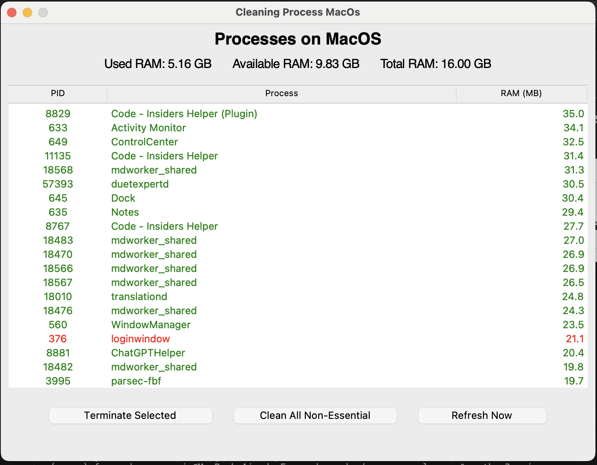

# Cleaning Process MacOs

A simple GUI application built with Python and Tkinter to view and manage running processes on macOS, focusing on identifying and terminating non-essential tasks to potentially free up system resources.

  <!-- Suggestion: Replace placeholder.png with an actual screenshot -->

## Features

*   Displays a list of running processes with PID, Name, and RAM usage (MB).
*   Sorts processes by RAM usage (descending) by default.
*   Highlights potentially essential system processes in red (non-essential in green).
*   Displays total, used, and available system RAM in GB.
*   Allows terminating selected non-essential processes.
*   Provides a button to terminate *all* identified non-essential processes.
*   Automatically refreshes the process list every few seconds.
*   Manual refresh button.
*   Preserves selection after refresh.
*   Basic check for root privileges (required for terminating some processes).

## Requirements

*   Python 3.x
*   Tkinter (usually included with Python on macOS)
*   `psutil` library

## Installation

1.  **Clone the repository:**
    ```bash
    git clone <repository-url> # Replace <repository-url> with the actual URL
    cd macos-process-manager # Or your repository directory name
    ```

2.  **Create and activate a virtual environment (recommended):**
    ```bash
    python3 -m venv myenv
    source myenv/bin/activate
    ```

3.  **Install dependencies:**
    ```bash
    pip install -r requirements.txt
    ```
    

## Usage

1.  **Activate the virtual environment (if not already active):**
    ```bash
    source myenv/bin/activate
    ```

2.  **Run the application:**
    ```bash
    python main.py
    ```
    or
    ```bash
    python3 main.py
    ```

    **Important:** For full functionality (terminating certain processes), you might need to run the application with root privileges:
    ```bash
    sudo python main.py
    ```
    or
    ```bash
    sudo python3 main.py
    ```
    Use `sudo` with caution.

## Configuration

The lists `ESSENTIAL_NAMES` and `ESSENTIAL_PIDS` in `main.py` contain processes considered essential for macOS stability. You can modify these lists based on your specific needs and system configuration, but be careful not to add critical system processes to the termination list.

## Contributing

Contributions are welcome! Please feel free to submit pull requests or open issues for bugs, feature requests, or improvements.

## Author

*   Fernando Moreno Ruiz

## License

This project is licensed under the MIT License - see the [LICENSE](LICENSE) file for details.
